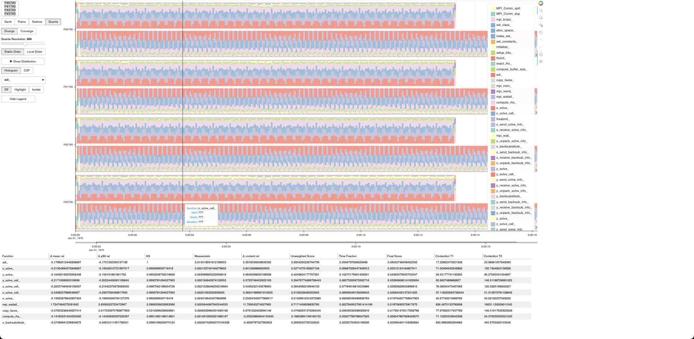

# Diff-Blup

**Diff-Blup** is a web-based _differential_ trace visualization tool.



[](https://opensource.org/license/bsd-3-clause)

**Diff-Blup** is a web-based trace visualization tool. It is based on the original [Blup](https://gitlab.inria.fr/blup/blup) tool by François Trahay.

This repo is currently heavily under construction.

## Building Diff-Blup

When running Diff-Blup for the first time, it automatically install
dependencies. All you need is `python`.

The `blup` shell script will try to locate/create a `.venv` virtual environment folder.
The desired enclosing folder for the `.venv` folder can be set with the `BLUP_CONFIG` environment variable.

You may need to install the `python3-tk` package that may not be installed by pip.

## Running Blup-Diff locally

You can visualize traces stored on your local machine by running:

```
blup /path/to/trace1.otf2 /path/to/trace2.otf2
```

This starts a local Blup server (on `localhost:5006`), and opens a browser that connects to
the server.
